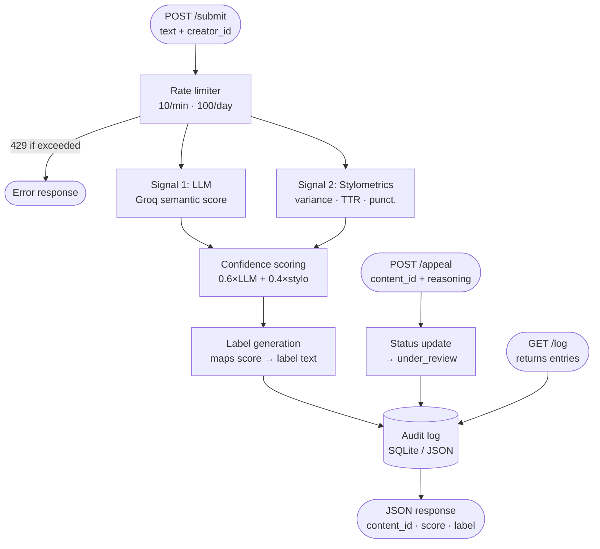

## Architecture and a 2–3 sentence narrative describing the submission and appeal flows
FLOW:
Submission flow:
POST /submit → Rate limiter → Signal 1 (LLM/Groq) ──┐
                                                      ├→ Confidence scoring → Label generation → Audit log → JSON response
                             Signal 2 (Stylometrics) ─┘

Appeal flow:
POST /appeal → Status update (→ under_review) → Audit log → JSON response
GET /log → returns recent audit entries

MERMAID DIAGRAM:

## Detection signals: What are your 2+ signals? What does each one measure? What does each signal's output look like (a score between 0–1? a binary flag?), and how will you combine them into a single confidence score?

Detection Signals
Signal 1 — LLM classification (Groq, llama-3.3-70b-versatile)

Measures semantic and stylistic coherence holistically. Prompts the model to assess whether the text reads as human- or AI-generated and return a score from 0.0 (human) to 1.0 (AI). Output: float 0–1. Blind spot: highly polished human writing (academic papers, legal briefs) can read as AI-generated.

Signal 2 — Stylometric heuristics (pure Python)

Measures three structural properties:

Sentence length variance — AI text tends toward uniform sentence lengths; human writing is more variable.
Type-token ratio (TTR) — vocabulary diversity. AI often repeats words more; humans are more varied.
Punctuation density — AI text tends to under-use dashes, ellipses, and colloquial punctuation.

Each metric is normalized to 0–1 (where 1 = AI-like), then averaged into a single stylometric score. Blind spot: non-native English speakers have lower variance and lower TTR, causing false positives.

Combining signals:
confidence = (0.6 × llm_score) + (0.4 × stylometric_score)
The LLM signal gets higher weight because it captures semantic patterns that heuristics miss. The stylometric signal acts as a tiebreaker and a check on the LLM signal when the two disagree significantly.

## Uncertainty representation: What does a confidence score of 0.6 mean to your system? How will you map raw signal outputs to a calibrated score? What threshold separates "likely AI" from "uncertain" from "likely human"?

Uncertainty Representation
0.0 – 0.39: Strongly signals human
0.40 – 0.64: Signals are weak or conflicting/Uncertain
0.65 – 1.0 Strongly signals AI generation/Likely AI

A score of 0.6 means: both signals are nudging toward AI, but neither is confident. The system is not making a strong claim. The label at this score should communicate uncertainty clearly.

The threshold asymmetry (human < 0.40, AI ≥ 0.65) reflects the false-positive problem: mislabeling a human's work as AI. A narrow "likely human" band would cause too many false positives against formal or careful writers.

## Transparency label design: What exact text will the label show for a high-confidence AI result? A high-confidence human result? An uncertain result? Write out the three label variants now, before you build the UI.

Transparency Labels
High-confidence AI (score ≥ 0.65):

"This content was likely generated with AI assistance. Our analysis detected patterns consistent with AI-generated text. If this is your original work, you can file an appeal below."

Uncertain (score 0.40–0.64):

"Our system was unable to determine with confidence whether this content is human- or AI-written. It has been published without an attribution label. If you believe this classification is wrong, you can file an appeal."

High-confidence human (score < 0.40):

"This content appears to be human-written. No AI-generation indicators were detected."

## Appeals workflow: Who can submit an appeal? What information do they provide? What does the system do when an appeal is received — what status changes, what gets logged? What would a human reviewer see when they open the appeal queue?

Appeals Workflow
Any creator with a content_id from a prior submission can submit an appeal via POST /appeal. They provide: content_id (required), creator_reasoning (required, free text). The system: (1) looks up the original submission by content_id, (2) updates the entry's status from classified to under_review, (3) appends an appeal record to the audit log containing the reasoning, the original confidence score, and a timestamp. Automated re-classification does not occur. A human reviewer opening the appeal queue via GET /log would see entries with "status": "under_review" and an appeal_reasoning field alongside the original scores, giving them everything needed to evaluate the appeal manually.

## Anticipated edge cases: What types of content will your system handle poorly? Name at least two specific scenarios — not generic risks like "inaccurate detection," but specific cases like "a poem with heavy use of repetition and simple vocabulary that your heuristics might score as AI-generated."

Anticipated Edge Cases

Non-native English speaker writing formally: A creator whose first language isn't English may write with low sentence-length variance, higher repetition, and minimal colloquial punctuation — all of which the stylometric signal reads as AI-like. The LLM signal may also flag it because formal multilingual writing can resemble AI patterns. This is a likely false positive category; the appeals workflow is the primary mitigation.

Lightly edited AI output: A creator who generates text with AI and then rewrites a portion of it introduces human irregularity (typos, variance, personal voice) on top of an AI skeleton. Neither signal is designed to detect partial AI use — the LLM signal may score it mid-range, and stylometrics may score it low because the edits introduced variance. The system will likely return an "uncertain" label, which is the honest answer.

Short texts (under 50 words): Stylometric heuristics become unreliable at very short lengths — variance and TTR calculations need sufficient sample size to be meaningful. A haiku or a one-paragraph submission may produce noisy scores. The system should flag short submissions in the audit log.

Legal Contracts, because they use rigid words similar to AI

Rhyming Schemes (Children books) - Uses similar sentence structure so AI will falsey detect.

## AI Tool Plan
M3 (submission endpoint + first signal): Which spec sections you'll provide to the AI tool (hint: your detection signals section + the diagram), what you'll ask it to generate (Flask app skeleton + the first signal function), and how you'll verify the output (test with a few inputs directly before wiring into the endpoint).
M4 (second signal + confidence scoring): Which spec sections you'll provide (detection signals + uncertainty representation + diagram), what you'll ask for (second signal function + scoring logic), and what you'll check (do scores vary meaningfully between clearly AI and clearly human text?).
M5 (production layer): Which spec sections you'll provide (label variants + appeals workflow + diagram), what you'll ask for (label generation logic + the /appeal endpoint), and how you'll verify (test all three label variants are reachable and that an appeal updates status correctly).

Milestone 3
What to give the AI: Give it the map of the system and the rules for Detective 1 (Predictability).

What to ask for: Ask the AI to build the basic web app skeleton and the code for Detective 1's scanner.

How to check it: Test it with a very common sentence (like "The cat sat on the mat") and a weird sentence (like "Bazinga! Space jazz hands"). Make sure the scanner can tell the difference.

Milestone 4
What to give the AI: Give it the rules for Detective 2 (Sentence Length) and the math rules for combining the scores.

What to ask for: Ask the AI to build the sentence-measuring tool and the math code that blends both detectives' scores into one final score.

How to check it: Give it text where every sentence is exactly five words long. Make sure the system flags it as looking very robotic.

Milestone 5
What to give the AI: Give it the rules for the stickers (Human, AI, or Uncertain) and the map for how appeals work.

What to ask for: Ask the AI to build the Label Maker and the "Hey, Wait!" (Appeal) button endpoint.

How to check it: Try to get all three stickers to print out by changing your text. Then, click the appeal button with a tracking number and check the diary log to make sure it successfully changes to "Under Review."
